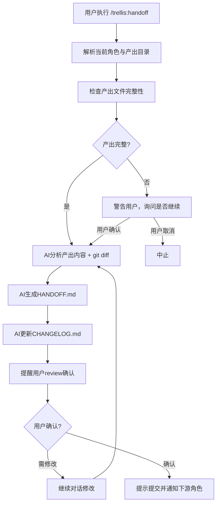

# SFRD-TS-03-1.5_Trellis三角色协作流水线模块微型设计说明书

## 目录

- [1. 介绍](#1-介绍)
  - [1.1. 目的](#11-目的)
  - [1.2. 定义和缩写](#12-定义和缩写)
  - [1.3. 参考和引用](#13-参考和引用)
- [2. 模块方案概述](#2-模块方案概述)
- [3. 模块详细设计](#3-模块详细设计)
  - [3.1. 目录结构设计](#31-目录结构设计)
  - [3.2. HANDOFF命令](#32-handoff命令)
  - [3.3. Spec分层架构](#33-spec分层架构)
  - [3.4. Hook注入逻辑](#34-hook注入逻辑)
  - [3.5. 分层角色约束架构](#35-分层角色约束架构)
- [4. 关联分析](#4-关联分析)
  - [4.6. 与现有系统的集成设计](#46-与现有系统的集成设计)
- [5. 可靠性设计 (FMEA)](#5-可靠性设计-fmea)
- [6. 变更控制](#6-变更控制)
  - [6.1. 变更列表](#61-变更列表)
- [7. 修订记录](#7-修订记录)

---

# 1. 介绍

## 1.1. 目的

本文档描述基于Trellis框架的三角色协作流水线模块设计，面向单仓库多角色协作场景，解决以下业务问题：

**核心目标**：
1. **角色识别与产出约束**：根据当前用户角色（PM/Designer/Frontend）自动约束产出物目录（可配置）与可编辑范围
2. **上下文与变更传递**：通过标准化交接文档与变更记录表，实现上游到下游的连贯信息传递
3. **规范沉淀与复用**：每个角色独立维护规范与约束，AI自动加载并遵循
4. **灵活协作链路**：角色交接不固定，任意角色之间都可通过 HANDOFF 完成交接

**目标受众**：
- 开发人员：理解模块实现细节，进行代码开发和维护
- 架构师：评估方案合理性，确保与现有系统兼容
- 产品经理/交互设计师：理解协作流程，参与工作流优化

## 1.2. 定义和缩写

| 术语 | 定义 |
|------|------|
| PM | Product Manager，产品经理，负责编写需求文档（PRD）的角色 |
| Designer | 交互设计师，基于PRD生成可运行的前端原型代码（带Mock数据） |
| Frontend | 前端开发工程师，基于原型代码补充真实API调用和业务逻辑 |
| HANDOFF文档 | 每个产出目录下的交接文档（`HANDOFF.md`），AI自动生成，包含关键要点、特别注意事项与下游补充清单 |
| 变更记录表 | 每个角色产出目录内的变更记录表（如 `CHANGELOG.md`），记录每次变更的内容、原因、时间、作者 |
| 产出目录绑定（-d） | `trellis init -d` 指定的目录，与角色强绑定并在初始化时创建；其他角色不可修改 |
| Spec | 开发规范文档 (`.trellis/spec/`)，定义各角色的工作标准和模式 |
| Hook | Trellis的生命周期钩子，在特定事件（如SessionStart、PreToolUse）触发脚本注入上下文 |

## 1.3. 参考和引用

1. Trellis官方文档：`https://github.com/mindfold-ai/Trellis`
2. Trellis Workflow指南：`.trellis/workflow.md`
3. Anthropic长运行Agent最佳实践：`https://www.anthropic.com/engineering/effective-harnesses-for-long-running-agents`
4. Trellis原有命令定义：`.claude/commands/trellis/*.md`
5. Trellis Hook实现：`.claude/hooks/session-start.py`, `.claude/hooks/inject-subagent-context.py`

---

# 2. 模块方案概述

## 2.1. 核心问题

当前三角色协作在单仓库内存在以下痛点：

1. **角色产出边界不清**：产出目录固定且缺乏强约束，容易被非授权角色修改
2. **变更追踪不一致**：缺少统一的变更记录表模板与维护规则，上下游难以追溯变更原因
3. **交接信息缺失**：口头/IM通知导致关键细节遗漏（Mock数据位置、需补逻辑清单）
4. **规范无法复用**：角色规范分散，AI无法按角色自动加载并遵循
5. **交接路径固定**：默认仅支持PM→Designer→Frontend，缺乏反向或跨角色交接能力

**业务影响**：
- 同步成本高，平均每次交接需多轮确认
- 变更信息缺失导致返工
- AI协助质量不稳定，需要反复提示规范

## 2.2. 解决方案

基于Trellis框架，设计**角色识别 + 产出约束 + 交接文档 + 变更记录**的协作模式：

**目标平台**：V1.0 仅支持 **Claude Code** 平台。Trellis 虽已支持 9 个 AI 平台（Cursor、iFlow、OpenCode 等），但三角色协作的核心约束能力（PreToolUse Hook 拦截 Edit/Write、SessionStart 上下文注入、SubagentStop 验证循环）依赖 Claude Code 的 Hook 机制，其他平台暂不具备等价能力。多平台适配作为后续迭代目标（见 4.3.5）。

**核心机制**：
1. **角色识别与目录约束** - 会话启动识别角色，自动限制产出目录（可自定义）与可编辑范围
2. **变更记录表标准化** - 每个角色产出目录维护统一变更记录表，记录变更内容/原因/时间
3. **HANDOFF交接** - /trellis:handoff 自动生成交接文档并写入变更记录表
4. **规范分层复用** - 新增 `spec/roles/` 存放角色规范，与技术栈规范并存，按角色注入

## 2.3. 角色协作链路示例（用户登录）

> 前提：项目已初始化，角色产出目录可自定义。协作通过 git + 线下通知进行，无自动化任务路由。

### 初始化

```bash
npm install -g @jahanxu/trellis@latest
cd my-project

# PM 初始化（-u 指定身份，-d 绑定产出目录）
trellis init -u pm-alice -d deliverables/requirements/
```

生成的目录结构：

```
.trellis/
├── roles.json               # 角色-目录映射（git tracked）
├── spec/roles/
│   ├── pm/
│   ├── designer/
│   └── frontend-impl/

deliverables/
├── requirements/             # PM 产出目录
├── prototypes/               # Designer 产出目录
└── production/               # Frontend 产出目录
```

### 阶段一：PM（Alice）编写需求

1. 启动 Claude Code 会话

AI：检测到角色 pm，自动约束产出物目录为 `deliverables/requirements/`，加载 `spec/roles/pm/index.md` 中的规范与约束。
通过对话完善 `deliverables/requirements/` 下的需求文档和变更记录表（CHANGELOG.md）。

2. PRD 完成后执行 HANDOFF

用户：`/trellis:handoff`

AI：
- 扫描 git 变更结合对话上下文，生成 `HANDOFF.md`（核心需求摘要、关键设计要点、注意事项）
- 写入变更记录表（变更内容、原因、时间），提醒用户 review 确认
- 用户 review 后如有问题，可继续对话修改，直到确认无误

3. 规范更新（可选）

`/trellis:update-spec` — 自动读取当前角色，更新 `spec/roles/pm/` 规范内容。

4. 提交并推送，线下通知 Designer

```bash
git add deliverables/requirements/
git commit -m "feat: add user-login requirements"
git push
```

### 阶段二：Designer（Bob）制作原型

1. 拉取代码，初始化身份

```bash
cd my-project
trellis init -u designer-bob -d deliverables/prototypes/
```

2. 启动 Claude Code 会话

AI：检测到角色 designer，自动约束产出物目录为 `deliverables/prototypes/`，加载 `spec/roles/designer/index.md`。
Bob 告知 AI 参考 `deliverables/requirements/` 下的需求文档和 CHANGELOG.md，AI 辅助完成交互原型。所有 mock 数据内联并标注 `// TODO: 替换为真实 API`。

3. 原型完成后执行 HANDOFF

用户：`/trellis:handoff`

AI：
- 扫描 git 变更结合对话上下文，生成 `HANDOFF.md`（组件结构、Mock 位置、需要前端补充的逻辑清单）
- 写入变更记录表，提醒用户 review 确认

4. 提交并推送，线下通知 Frontend

```bash
git add deliverables/prototypes/
git commit -m "feat: add user-login prototype"
git push
```

### 阶段三：Frontend（Carol）实现生产代码

1. 拉取代码，初始化身份

```bash
cd my-project
trellis init -u frontend-carol -d deliverables/production/
```

2. 启动 Claude Code 会话

AI：检测到角色 frontend，自动约束产出物目录为 `deliverables/production/`，加载 `spec/roles/frontend-impl/index.md`。
Carol 告知 AI 参考 `deliverables/prototypes/` 下的原型和 CHANGELOG.md，AI 辅助完成前端实现。

3. 实现完成后执行 HANDOFF

用户：`/trellis:handoff`

AI：
- 扫描 git 变更结合对话上下文，生成 `HANDOFF.md`
- 写入变更记录表，提醒用户 review 确认

4. 提交并推送，线下通知其他角色

```bash
git add deliverables/production/
git commit -m "feat: add user-login production code"
git push
```

## 2.4. 返工回路示例

> 目标：展示非线性返工，交接路径不固定，任意角色间均可通过 HANDOFF 传递信息。

**场景**：Frontend Carol 在开发中发现接口字段与原型不一致。

```
Carol（Frontend）                    Bob（Designer）                 Alice（PM）
  │                                    │                              │
  ├─ 在 production/ 更新 CHANGELOG     │                              │
  ├─ /trellis:handoff                  │                              │
  ├─ git push + 线下通知 Bob ─────────→│                              │
  │                                    ├─ git pull，读 Carol 的变更记录 │
  │                                    ├─ 调整原型                      │
  │                                    ├─ /trellis:handoff              │
  │                                    ├─ git push + 线下通知 Alice ──→│
  │                                    │                              ├─ 修订需求边界
  │                                    │                              ├─ /trellis:handoff
  │                                    │                              ├─ git push + 通知
  ├─ git pull，读最新 CHANGELOG ←──────────────────────────────────────┤
  ├─ 按最新需求修订实现                  │                              │
  └─ /trellis:handoff                  │                              │
```

**关键约束**：
- 每个角色只在自己的产出目录内修改
- CHANGELOG 形成可追溯的变更链路
- 回流不依赖固定顺序，任意角色执行 HANDOFF 即可

## 2.5. 协作原则

1. **角色识别 + 目录约束**：通过 `roles.json` 和 Hook 约束产出物目录，确保产出与变更记录符合规范
2. **CHANGELOG 驱动的信息传递**：每个角色维护自己目录下的变更记录表，记录每次变更的内容、原因和时间，作为上下游信息同步的核心载体
3. **/trellis:handoff**：AI 自动生成交接文档并更新变更记录表，确保信息完整传递
4. **/trellis:update-spec**：维护角色规范与约束，确保后续迭代遵循最新标准
5. **任意角色交接**：交接路径不固定（非 PM→Designer→Frontend 单向链），任意角色间均可通过 HANDOFF 传递信息
6. **AI 辅助维护**：AI 读取上游产出目录的 CHANGELOG 和 HANDOFF，辅助当前角色快速完成产出和变更记录
7. **线下协调 + git 同步**：角色间通过线下通知 + git push/pull 协调，不依赖自动化任务路由

---

# 3. 模块详细设计

## 3.1. 目录结构设计

### 3.1.1. 功能描述

定义三角色协作所需的目录结构，包括产出物存储、角色规范、交接文档与变更记录等。

### 3.1.2. 目录树

```bash
project/
├── requirements/              # PM产出目录（可配置）
│   ├── user-login/
│   │   ├── prd.md
│   │   ├── user-stories.md
│   │   ├── CHANGELOG.md       # 变更记录表
│   │   └── HANDOFF.md          # 交接文档
│   └── payment/
│       ├── prd.md
│       ├── CHANGELOG.md
│       └── HANDOFF.md
│
├── prototypes/                # Designer产出目录（可配置）
│   └── user-login/
│       ├── LoginPage.tsx
│       ├── LoginForm.tsx
│       ├── CHANGELOG.md
│       └── HANDOFF.md
│
├── production/                # Frontend产出目录（可配置）
│   └── features/
│       └── user-login/
│           ├── LoginContainer.tsx
│           ├── useAuth.ts
│           ├── CHANGELOG.md
│           └── HANDOFF.md
│
├── .trellis/
│   ├── roles.json             # 【新增】项目级角色-目录映射（git tracked，团队共享）
│   │
│   ├── tasks/                 # 扁平任务目录（保持现有结构）
│   │   ├── 01-user-login-req/
│   │   │   ├── task.json      # 含 role + output_dir 可选字段
│   │   │   └── implement.jsonl
│   │   ├── 01-user-login-prototype/
│   │   │   ├── task.json
│   │   │   └── implement.jsonl
│   │   └── 01-user-login-impl/
│   │       ├── task.json
│   │       └── implement.jsonl
│   │
│   ├── spec/
│   │   ├── frontend/         # 【保留】前端技术栈规范
│   │   ├── backend/          # 【保留】后端技术栈规范
│   │   ├── guides/           # 【保留】思维指南
│   │   └── roles/            # 【新增】角色工作规范
│   │       ├── pm/
│   │       │   ├── index.md
│   │       │   ├── prd-template.md
│   │       │   └── changelog-template.md
│   │       ├── designer/
│   │       │   ├── index.md
│   │       │   ├── prototype-guidelines.md
│   │       │   └── changelog-template.md
│   │       └── frontend-impl/
│   │           ├── index.md
│   │           ├── api-integration.md
│   │           └── changelog-template.md
│   │
│   ├── workspace/
│   │   ├── pm-alice/
│   │   ├── designer-bob/
│   │   └── frontend-carol/
│   │
│   └── scripts/
│       ├── check-deliverables.sh
│       └── handoff.sh
│
└── .claude/
    ├── commands/
    │   └── trellis/
    │       ├── handoff.md
    │       ├── update-spec-role.md
    │       └── before-role-work.md
    └── hooks/
        └── session-start.py
```

### 3.1.4. 初始化与绑定规则（修订）

角色与目录的绑定采用**分层约束模型**，不修改 `.developer` 文件结构（详见 3.5 节）：

1. **项目级绑定**：通过 `.trellis/roles.json` 记录开发者-角色-目录的映射关系，提交到 git 供团队共享
2. **任务级绑定**：通过 `task.json` 的 `role` + `output_dir` 字段实现任务级精确约束，可覆盖项目级配置
3. **约束执行**：通过 PreToolUse Hook 拦截 Edit/Write 工具调用，校验目标文件路径是否在允许范围内
4. `.trellis/.developer` 文件**不新增字段**（仅保留 `name` + `initialized_at`），避免破坏现有 15+ 处调用链路

### 3.1.5. `trellis init -d` 详细行为

#### 角色解析规则

角色信息从 `-u` 参数的**前缀**中解析：

```
trellis init -u <role>-<name> -d <output_dir>
                 │       │        │
                 │       │        └─ 产出目录（相对于项目根目录）
                 │       └─ 开发者标识（任意字符串）
                 └─ 角色标识（必须是已知角色之一）
```

**已知角色列表**：`pm`、`designer`、`frontend`（可扩展）

**解析示例**：

| `-u` 值 | 解析结果 | 说明 |
|---------|---------|------|
| `pm-alice` | role=`pm`, name=`pm-alice` | 标准格式 |
| `designer-bob` | role=`designer`, name=`designer-bob` | 标准格式 |
| `frontend-carol` | role=`frontend`, name=`frontend-carol` | 标准格式 |
| `alice` | role=`null`, name=`alice` | 无角色前缀，非协作模式 |
| `admin-dave` | role=`null`, name=`admin-dave` | 前缀不在已知角色列表中 |

**解析伪代码**：

```python
KNOWN_ROLES = {"pm", "designer", "frontend"}

def parse_role_from_username(username: str) -> tuple[str | None, str]:
    """从 -u 参数解析角色。返回 (role, full_name)。"""
    parts = username.split("-", 1)
    if len(parts) == 2 and parts[0] in KNOWN_ROLES:
        return parts[0], username
    return None, username
```

#### 协作模式 vs 普通模式

| 条件 | 模式 | 行为 |
|------|------|------|
| 仅 `-u alice` | 普通模式 | 与当前行为完全一致，不生成 roles.json |
| `-u pm-alice -d deliverables/req/` | 协作模式 | 生成/追加 roles.json，创建产出目录 |
| 仅 `-d deliverables/req/`（无 `-u`） | 错误 | 提示：`-d 需要配合 -u 使用` |
| `-u pm-alice`（无 `-d`） | 普通模式 | 角色前缀被忽略，name 正常写入 .developer |

#### 协作模式执行流程

```
trellis init -u pm-alice -d deliverables/requirements/
  │
  ├─ 1. 解析角色：pm-alice → role=pm, name=pm-alice
  ├─ 2. 创建 .trellis/.developer（name=pm-alice, initialized_at=...）
  ├─ 3. 创建/追加 .trellis/roles.json
  │     ├─ 文件不存在 → 新建，写入当前开发者映射
  │     └─ 文件已存在 → 追加当前开发者到 developers + directories
  ├─ 4. 创建 .trellis/workspace/pm-alice/
  ├─ 5. 创建产出目录 deliverables/requirements/（如不存在）
  ├─ 6. 创建 .trellis/spec/roles/pm/（如模板存在）
  ├─ 7. 创建 bootstrap 任务（含 role=pm, output_dir=deliverables/requirements/）
  └─ 8. 设为 .current-task
```

#### 多次 init（追加模式）

第二个开发者在同一项目中 init 时，roles.json 已存在：

```bash
# Alice 已 init 完毕，Bob 拉取代码后执行：
trellis init -u designer-bob -d deliverables/prototypes/
```

**roles.json 变化**：

```json
// init 前（Alice 已写入）
{
  "directories": {
    "deliverables/requirements/": "pm"
  },
  "developers": {
    "pm-alice": { "role": "pm", "output_dir": "deliverables/requirements/" }
  }
}

// init 后（Bob 追加）
{
  "directories": {
    "deliverables/requirements/": "pm",
    "deliverables/prototypes/": "designer"
  },
  "developers": {
    "pm-alice": { "role": "pm", "output_dir": "deliverables/requirements/" },
    "designer-bob": { "role": "designer", "output_dir": "deliverables/prototypes/" }
  }
}
```

**冲突处理**：
- 同一开发者名再次 init → 覆盖该开发者的映射，输出警告
- 同一目录被不同角色绑定 → 拒绝并提示冲突

## 3.2. HANDOFF命令

### 3.2.1. 功能描述

`/trellis:handoff` 命令用于完成阶段性工作，AI 自动分析产出内容，生成交接文档（HANDOFF.md）并更新变更记录表（CHANGELOG.md）。

### 3.2.2. 输入和输出

**输入**：
- 当前角色约束（通过分层解析，见 3.5 节）
- 当前角色绑定的产出目录中的所有文件
- git 变更记录 + 对话上下文

**输出**：
- 在产出目录内生成/更新 `HANDOFF.md`
- 在产出目录内更新 `CHANGELOG.md`
- 提醒用户 review 确认

### 3.2.3. 命令约束

1. **产出目录限定**：仅允许在当前角色绑定的产出目录内生成/更新 `HANDOFF.md` 与 `CHANGELOG.md`，禁止跨目录写入
2. **最小产出检查**：若产出目录为空或缺少 CHANGELOG.md，则提示补全；用户确认后才可继续
3. **无任务时也可执行**：HANDOFF 不依赖 `.current-task`，角色约束通过 roles.json（L2）兜底

### 3.2.4. 内部逻辑流程



### 3.2.5. HANDOFF文档结构

**PM的HANDOFF模板**：

```markdown
# {功能名称} - 需求交接文档

## 📋 任务信息
- **功能ID**: user-login
- **功能名称**: 用户登录功能
- **完成人**: pm-alice
- **完成时间**: 2026-02-28 14:30:00

## 🎯 核心需求
（AI总结PRD核心要点，2-3段）

## 📄 产出文件
- `prd.md` - 产品需求文档
- `user-stories.md` - 用户故事

## 🔑 关键设计要点
1. 支持邮箱+密码登录
2. 支持第三方登录（微信、GitHub）
3. 登录失败3次后显示验证码

## ⚠️ 特别注意事项
- 第三方登录按钮布局参考 Figma 设计稿
- 密码输入框需要显示/隐藏切换
- 记住我功能使用 localStorage

## 🔗 相关资源
- Figma 设计稿: https://figma.com/...
- API 文档: https://docs.internal.com/auth

## 📞 联系方式
如有疑问，请联系 pm-alice (alice@company.com)
```

**Designer的HANDOFF模板**：

```markdown
# {功能名称} - 原型交接文档

## 📋 任务信息
- **功能ID**: user-login
- **基于需求**: requirements/user-login
- **完成人**: designer-bob
- **完成时间**: 2026-02-28 18:00:00

## 🎨 设计说明
（AI总结设计思路，2-3段）

## 📄 产出文件
- `LoginPage.tsx` - 登录页面容器
- `LoginForm.tsx` - 登录表单组件
- `SocialLoginButtons.tsx` - 第三方登录按钮

## 🧩 组件结构
（组件树）

## 💾 Mock数据说明
当前使用的Mock数据：
```typescript
const mockUser = {
  id: "1",
  email: "test@example.com",
  name: "Test User"
};

// Mock登录逻辑在 LoginForm.tsx 第45行
const handleLogin = async () => {
  // TODO: 替换为真实API调用
  setTimeout(() => setUser(mockUser), 1000);
};
```

## 🔄 需要前端补充的逻辑
1. 替换 `handleLogin` 中的Mock为真实API调用
2. 添加错误处理（网络错误、登录失败）
3. 添加加载状态管理
4. 实现"记住我"功能的持久化

## ⚠️ 特别注意事项
- 第三方登录需要在父级页面注入SDK脚本
- 密码输入框已实现显示/隐藏，保持该交互
- 表单验证已完成，前端需保留

## 📞 联系方式
如有疑问，请联系 designer-bob (bob@company.com)
```

### 3.2.6. CHANGELOG.md 数据结构

每个角色的产出目录内维护一份 `CHANGELOG.md`，作为变更追溯的核心载体。

**表头结构**：

```markdown
# CHANGELOG - {产出目录名}

> 变更记录表，由 AI 自动维护（/trellis:handoff 时追加）。

| 日期 | 作者 | 类型 | 摘要 | 关联文件 |
|------|------|------|------|----------|
```

**字段定义**：

| 字段 | 格式 | 说明 |
|------|------|------|
| 日期 | `YYYY-MM-DD HH:mm` | handoff 执行时间 |
| 作者 | `.developer` 中的 `name` | 如 `pm-alice` |
| 类型 | `新增` / `修改` / `删除` / `重构` | 本次变更主类型 |
| 摘要 | 一句话（≤80字） | AI 基于 git diff + 对话上下文生成 |
| 关联文件 | 文件名列表 | 本次变更涉及的关键文件 |

**初始模板**（`trellis init -d` 时自动创建）：

```markdown
# CHANGELOG - requirements

> 变更记录表，由 AI 自动维护（/trellis:handoff 时追加）。

| 日期 | 作者 | 类型 | 摘要 | 关联文件 |
|------|------|------|------|----------|
```

**AI 追加示例**（`/trellis:handoff` 执行后）：

```markdown
| 2026-02-28 14:30 | pm-alice | 新增 | 用户登录功能 PRD 初稿，含邮箱密码和第三方登录两种方式 | `prd.md`, `user-stories.md` |
| 2026-03-01 10:00 | pm-alice | 修改 | 补充验证码触发条件（连续失败3次），调整第三方登录按钮顺序 | `prd.md` |
```

**维护规则**：
1. **只追加，不修改**：每次 handoff 向表尾追加一行，不修改历史记录
2. **AI 自动生成**：`/trellis:handoff` 命令负责生成条目，用户 review 后确认
3. **初始创建**：`trellis init -d` 时在产出目录下自动创建空 CHANGELOG.md
4. **缺失补建**：若 handoff 时发现 CHANGELOG.md 不存在，自动创建后追加

### 3.2.7. handoff.md 命令提示词

`/trellis:handoff` 命令对应的文件为 `.claude/commands/trellis/handoff.md`，内容如下：

````markdown
---
description: "Complete current phase and generate handoff document for downstream roles"
---

You are executing the **HANDOFF** workflow for a collaborative project.

## Step 1: Identify Context

1. Read `.trellis/.developer` to get the current developer name
2. Read `.trellis/roles.json` to determine the role and bound output directory
3. If roles.json doesn't exist or current developer has no role mapping, abort with:
   "Error: No role binding found. Run `trellis init -u <role>-<name> -d <dir>` first."

## Step 2: Check Deliverables

1. List all files in the bound output directory
2. If the directory is empty, warn: "Output directory is empty. Are you sure you want to proceed?" and wait for confirmation
3. Run `git diff --name-only` scoped to the output directory to identify recent changes

## Step 3: Generate HANDOFF.md

Create or overwrite `HANDOFF.md` **inside the output directory** with the following structure:

```
# {Feature/Task Name} - Handoff Document

## Task Info
- **Role**: {current role}
- **Developer**: {developer name}
- **Output Directory**: {bound directory}
- **Completed**: {current timestamp}

## Summary
(Summarize what was done in 2-3 paragraphs, based on git diff + conversation context)

## Deliverable Files
(List all files in the output directory with one-line descriptions)

## Key Design Decisions
(Numbered list of important decisions and rationale)

## Notes for Downstream
(Specific items the next role should pay attention to)

## Contact
Questions? Reach out to {developer name}
```

## Step 4: Update CHANGELOG.md

1. If `CHANGELOG.md` doesn't exist in the output directory, create it with the standard header
2. Append one row to the changelog table:
   - Date: current datetime (YYYY-MM-DD HH:mm)
   - Author: developer name from .developer
   - Type: Infer from git diff (新增/修改/删除/重构)
   - Summary: One sentence (≤80 chars) summarizing the changes
   - Files: Key files changed

## Step 5: User Review

1. Show the generated HANDOFF.md content to the user
2. Show the new CHANGELOG.md entry
3. Ask: "Please review the handoff document. Reply with changes or confirm to finalize."
4. If the user requests changes, modify and re-show
5. Once confirmed, remind:
   - `git add {output_dir}/` to stage changes
   - `git commit` and `git push`
   - Notify the downstream developer offline

## Constraints

- **NEVER** write files outside the bound output directory
- HANDOFF.md and CHANGELOG.md must be placed at the **root** of the output directory
- If `--message` argument is provided, include it in the HANDOFF.md Notes section
````

### 3.2.8. 配置项

无新增配置项。命令参数：

```bash
# 命令格式
/trellis:handoff

# 可选：指定交接留言（跳过询问环节）
/trellis:handoff --message "重点关注第三方登录流程"
```

## 3.3. Spec分层架构

### 3.3.1. 功能描述

为避免与原有Trellis的`frontend/backend/guides/`目录冲突，新增`spec/roles/`目录存放角色工作规范，实现技术栈规范与角色规范的分层复用。

### 3.3.2. 目录映射

```bash
.trellis/spec/
├── frontend/         # 【保留】前端技术栈规范（React/Vue组件、Hook等）
├── backend/          # 【保留】后端技术栈规范（API、数据库、Shell等）
├── guides/           # 【保留】思维指南（跨层思考、代码复用等）
└── roles/            # 【新增】角色工作规范
    ├── pm/           # PM工作规范
    ├── designer/     # Designer工作规范
    └── frontend-impl/# Frontend实现规范（避免与frontend/冲突）
```

### 3.3.3. 注入逻辑

根据角色选择注入的spec：

| 角色 | 注入spec目录 | 说明 |
|------|-------------|------|
| pm | `roles/pm/` | 仅需要PM规范 |
| designer | `roles/designer/` + `frontend/component-guidelines.md` | 复用技术栈规范 |
| frontend | `roles/frontend-impl/` + `frontend/type-safety.md` + `backend/script-conventions.md` | 复用前后端规范 |

**实施伪代码**：

```python
def get_spec_paths_for_role(role: str) -> list[str]:
    role_specs = {
        "pm": [
            ".trellis/spec/roles/pm/index.md",
            ".trellis/spec/roles/pm/prd-template.md",
            ".trellis/spec/roles/pm/changelog-template.md",
        ],
        "designer": [
            ".trellis/spec/roles/designer/index.md",
            ".trellis/spec/roles/designer/prototype-guidelines.md",
            ".trellis/spec/roles/designer/changelog-template.md",
            ".trellis/spec/frontend/component-guidelines.md",  # 复用
        ],
        "frontend": [
            ".trellis/spec/roles/frontend-impl/index.md",
            ".trellis/spec/roles/frontend-impl/changelog-template.md",
            ".trellis/spec/frontend/type-safety.md",  # 复用
            ".trellis/spec/backend/script-conventions.md",  # 复用
        ],
    }

    common = [".trellis/spec/guides/code-reuse-thinking-guide.md"]
    return role_specs.get(role, []) + common
```

### 3.3.4. 兼容性保证

1. **不破坏原有命令**：`/trellis:update-spec` 仍然更新 `frontend/backend/guides/`
2. **新增角色命令**：`/trellis:update-spec-role` 更新 `roles/{role}/`
3. **启动命令兼容**：`/trellis:start` 根据角色选择性读取spec索引

## 3.4. Hook注入逻辑

### 3.4.1. 功能描述

修改 `.claude/hooks/session-start.py`，在会话启动时根据当前角色自动注入角色规范、产出目录上下文与上游交接信息。

### 3.4.2. 注入内容

**启动时注入**：

```xml
<upstream-context>
## 基于上游产出
- 类型: requirement
- ID: user-login
- 路径: requirements/user-login

### 交接文档
# 用户登录功能 - 需求交接文档
...（完整HANDOFF.md内容）

### 变更记录
...（CHANGELOG.md 内容）

### 上游产出文件

#### prd.md
```markdown
# 用户登录功能 PRD
...
```

#### user-stories.md
```markdown
# 用户故事
...
```
</upstream-context>
```

### 3.4.3. 实现伪代码

```python
def get_upstream_dirs(role: str, roles_json: dict) -> list[str]:
    """获取当前角色的上游产出目录列表。

    上游定义：roles.json 中所有 非当前角色 绑定的目录。
    设计选择：不固定 PM→Designer→Frontend 链路，
    任意角色均可读取其他角色的产出物。
    """
    directories = roles_json.get("directories", {})
    return [
        dir_path
        for dir_path, dir_role in directories.items()
        if dir_role != role
    ]


def inject_role_context(repo_root: Path):
    """根据角色注入上下文（角色规范 + 上游 HANDOFF/CHANGELOG）"""
    role, output_dir = resolve_role_constraint(repo_root)
    if not role:
        return  # 无角色约束，跳过

    # 注入角色规范
    spec_paths = get_spec_paths_for_role(role)
    print("<role-context>")
    print(f"## 当前角色: {role}")
    print(f"## 产出目录: {output_dir}")
    print()
    for spec_path in spec_paths:
        full = repo_root / spec_path
        if full.is_file():
            print(f"### {spec_path}")
            print(full.read_text(encoding="utf-8")[:3000])
            print()
    print("</role-context>")

    # 注入上游产出目录的 HANDOFF 和 CHANGELOG
    roles_json = load_roles_json(repo_root)
    if not roles_json:
        return

    upstream_dirs = get_upstream_dirs(role, roles_json)
    if not upstream_dirs:
        return

    print("<upstream-context>")
    for upstream_dir in upstream_dirs:
        upstream_path = repo_root / upstream_dir
        if not upstream_path.is_dir():
            continue
        # 读取 HANDOFF 文档
        for handoff in sorted(upstream_path.rglob("HANDOFF.md")):
            print(f"### {handoff.relative_to(repo_root)}")
            content = handoff.read_text(encoding="utf-8")
            print(content[:3000])
            if len(content) > 3000:
                print("\n... (truncated)")
            print()
        # 读取 CHANGELOG
        for changelog in sorted(upstream_path.rglob("CHANGELOG.md")):
            print(f"### {changelog.relative_to(repo_root)}")
            content = changelog.read_text(encoding="utf-8")
            print(content[:3000])
            if len(content) > 3000:
                print("\n... (truncated)")
            print()
    print("</upstream-context>")
```

### 3.4.4. 异常处理

| 异常场景 | 处理策略 |
|---------|---------|
| roles.json 不存在 | 跳过角色注入，使用默认 Trellis 注入 |
| HANDOFF 文档缺失 | 记录警告，继续注入其他文件 |
| 上游目录不存在 | 跳过该目录，不影响其他注入 |
| 文件过大（>10MB） | 仅注入前 3000 字符，添加截断提示 |

## 3.5. 分层角色约束架构

### 3.5.1. 问题背景

实际开发中，并非所有改动都通过正式任务驱动。用户可能直接与AI对话进行修改（如"把需求文档措辞改一下"），此时没有 `.current-task`，若角色约束仅存于 `task.json`，则非任务驱动的改动**完全无约束**，任何人可写任何目录。

据观察，非任务驱动的改动可能占日常操作的 50% 以上，因此必须有**持久兜底约束**。

### 3.5.2. 设计方案：三层 Fallback 解析链

角色约束的解析采用**分层优先级**模型：

```
┌─────────────────────────────────────────────────────┐
│              角色约束解析优先级                        │
│                                                     │
│  L1  .current-task → task.json.role / output_dir    │
│       ↑ 最高优先级，任务生命周期内有效                  │
│       适用：正式任务流（create → start → handoff）     │
│                                                     │
│  L2  .developer.name → roles.json[name]             │
│       ↑ 持久兜底，项目生命周期内有效                    │
│       适用：非任务驱动的随手改                         │
│                                                     │
│  L3  无约束（放行）                                   │
│       ↑ 非协作项目，不启用角色约束                      │
│       适用：未配置 roles.json 的项目                   │
└─────────────────────────────────────────────────────┘
```

### 3.5.3. roles.json 数据结构

**文件位置**：`.trellis/roles.json`（提交到 git，团队共享）

```json
{
  "directories": {
    "deliverables/requirements/": "pm",
    "deliverables/prototypes/": "designer",
    "deliverables/production/": "frontend"
  },
  "developers": {
    "alice": {
      "role": "pm",
      "output_dir": "deliverables/requirements/"
    },
    "bob": {
      "role": "designer",
      "output_dir": "deliverables/prototypes/"
    },
    "carol": {
      "role": "frontend",
      "output_dir": "deliverables/production/"
    }
  }
}
```

**设计决策**：

| 决策点 | 选择 | 理由 |
|--------|------|------|
| 存储位置 | `.trellis/roles.json`（非 `.developer`） | `.developer` 是 gitignored 的，角色映射是团队共识，应 git tracked |
| `.developer` 是否扩展 | **不扩展**，保留 `name` + `initialized_at` | 避免破坏现有 `get_developer()` 的 15+ 处调用 |
| 目录映射冗余 | `directories` 和 `developers` 两个维度 | `directories` 用于反向查询（"这个目录归谁"），`developers` 用于正向查询（"这个人能写哪里"） |

### 3.5.4. task.json 扩展字段

在现有 task.json schema 上**新增**两个可选字段（向下兼容）：

```json
{
  "id": "user-login-req",
  "title": "用户登录需求",
  "status": "in_progress",
  "creator": "alice",
  "assignee": "alice",

  "role": "pm",
  "output_dir": "deliverables/requirements/user-login"
}
```

**Designer 的任务示例**：

```json
{
  "id": "user-login-prototype",
  "title": "用户登录原型",
  "status": "in_progress",
  "creator": "bob",
  "assignee": "bob",

  "role": "designer",
  "output_dir": "deliverables/prototypes/user-login"
}
```

**兼容性**：旧任务无 `role`/`output_dir` 字段时，约束解析自动降级到 L2（roles.json）或 L3（无约束）。

### 3.5.5. 约束解析实现

```python
def resolve_role_constraint(repo_root: Path) -> tuple[str | None, str | None]:
    """三层 fallback 解析当前角色与允许的输出目录。

    Returns:
        (role, output_dir) 或 (None, None) 表示无约束
    """
    # L1: 活跃任务（最高优先级）
    current_task = get_current_task(repo_root)
    if current_task:
        task_json = load_task_json(repo_root / current_task)
        if task_json and task_json.get("role") and task_json.get("output_dir"):
            return task_json["role"], task_json["output_dir"]

    # L2: 项目级角色映射（持久兜底）
    roles_file = repo_root / ".trellis" / "roles.json"
    if roles_file.is_file():
        roles = json.loads(roles_file.read_text(encoding="utf-8"))
        developer = get_developer(repo_root)  # 读 .developer 的 name=
        if developer and developer in roles.get("developers", {}):
            mapping = roles["developers"][developer]
            return mapping.get("role"), mapping.get("output_dir")

    # L3: 无约束
    return None, None
```

### 3.5.6. Hook 执行约束（enforce-output-dir.py）

新增 PreToolUse Hook，拦截 Edit/Write 工具调用：

**settings.json 新增配置**：

```json
{
  "hooks": {
    "PreToolUse": [
      {
        "matcher": "Edit|Write",
        "hooks": [{
          "type": "command",
          "command": "python3 .claude/hooks/enforce-output-dir.py",
          "timeout": 5
        }]
      }
    ]
  }
}
```

**Hook 实现逻辑**：

```python
def main():
    input_data = json.load(sys.stdin)
    tool_name = input_data["tool_name"]
    file_path = input_data["tool_input"].get("file_path", "")

    repo_root = find_repo_root(input_data.get("cwd", os.getcwd()))
    if not repo_root:
        allow()
        return

    # 解析当前角色约束
    role, output_dir = resolve_role_constraint(Path(repo_root))

    # L3: 无约束，放行
    if not role or not output_dir:
        allow()
        return

    # 将 file_path 转为相对路径
    rel_path = os.path.relpath(file_path, repo_root)

    # 白名单：.trellis/ 内部文件始终放行（spec、task、workspace 等元数据）
    if rel_path.startswith(".trellis/") or rel_path.startswith(".claude/"):
        allow()
        return

    # 非产出目录的文件（如项目配置、README 等）放行
    # 仅当目标文件落在「某个角色的产出目录」内但不是当前角色的，才拒绝
    roles_json = load_roles_json(Path(repo_root))
    if roles_json:
        protected_dirs = roles_json.get("directories", {})
        for protected_dir, dir_role in protected_dirs.items():
            if rel_path.startswith(protected_dir) and dir_role != role:
                deny(f"角色 {role} 不允许写入 {protected_dir}（归属角色: {dir_role}）。"
                     f"当前约束来源: {'task.json' if from_task else 'roles.json'}")
                return

    allow()
```

### 3.5.7. 约束力评级

| 约束层 | 机制 | 效力 | 适用工具 | 绕过方式 |
|--------|------|------|----------|----------|
| 软提示 | SessionStart 注入角色信息 | ~90% | 所有平台 | AI 偶尔忽略提示 |
| Hook 拦截 | PreToolUse 对 Edit/Write deny | ~95% | Claude Code / iFlow | Bash 工具直接 `sed`/`echo >` |
| Bash 解析 | PreToolUse 对 Bash 命令分析 | ~60% | Claude Code | 命令拼接/管道难以可靠解析 |

**设计选择**：采用 **软提示 + Hook 拦截**（L1 + L2）组合。不拦截 Bash 工具，因为：
1. AI 代理 95%+ 的文件操作通过 Edit/Write 工具完成
2. Bash 命令解析不可靠，误杀率高
3. 成本收益比不合理

### 3.5.8. 场景覆盖验证

| 场景 | 约束来源 | 效果 |
|------|----------|------|
| PM 正式创建任务写需求 | L1 (task.json) | `role=pm, output_dir=requirements/login` → 只允许写 `requirements/login/` |
| PM 随手改需求措辞（无任务） | L2 (roles.json) | `role=pm, output_dir=requirements/` → 只允许写 `requirements/` |
| PM 临时帮 Designer 做原型 | L1 覆盖 L2 | 创建 `--role designer` 任务 → 任务期间可写 `prototypes/`，结束后回退 L2 |
| 未配置 roles.json 的项目 | L3 (无约束) | 放行所有操作，不影响非协作项目 |
| 修改 `.trellis/spec/` 或项目配置 | 白名单放行 | 不受角色约束限制 |
| Designer 试图写 `production/` | L1 或 L2 deny | Hook 返回 deny 并提示"归属角色: frontend" |

### 3.5.9. 与原方案的差异对比

| 维度 | 原方案（角色在 .developer） | 修订方案（分层约束） |
|------|---------------------------|---------------------|
| `.developer` 改动 | 需新增 `role`/`output_dir` 字段 | **不改动** |
| 现有代码破坏性 | 影响 `get_developer()` 15+ 处调用 | **零破坏** |
| 非任务驱动的约束 | 有（.developer 持久） | 有（roles.json 持久） |
| 一人多角色 | 需重新 init 切换 | 创建不同 role 的任务即可 |
| 团队可见性 | .developer 是 gitignored | roles.json 是 git tracked，团队可见 |
| 新增文件 | 无 | `roles.json` + `enforce-output-dir.py` |
| 任务目录结构 | 按角色分子目录 `tasks/{role}/` | **保持扁平** `tasks/MM-DD-slug/` |

### 3.5.10. 异常处理

| 异常场景 | 处理策略 |
|---------|---------|
| roles.json 不存在 | 降级到 L3（无约束），非协作项目的正常状态 |
| roles.json 中无当前开发者 | 降级到 L3，提示用户将自己加入 roles.json |
| task.json 有 role 但无 output_dir | 使用 roles.json 的 output_dir 补全 |
| output_dir 指向不存在的目录 | Hook 放行（目录可能即将创建），handoff 时再校验 |
| roles.json JSON 格式损坏 | 降级到 L3，输出警告 |

---

# 4. 关联分析

## 4.1. 对原有Trellis命令的影响

| 命令 | 影响程度 | 说明 | 应对措施 |
|------|---------|------|---------|
| `/trellis:start` | 中 | 需要根据角色选择性读取spec，并展示角色信息 | 修改Step 3逻辑，检测角色后读取对应spec |
| `/trellis:update-spec` | 低 | 仍然更新 `frontend/backend/guides/` | 保持不变，新增 `/trellis:update-spec-role` |
| `/trellis:before-frontend-dev` | 低 | 仍然读取 `frontend/` 目录 | 保持不变 |
| `/trellis:finish-work` | 中 | 若要求自动写入CHANGELOG/HANDOFF，需要扩展逻辑 | 增加角色判断与产出目录检测 |
| `/trellis:record-session` | 低 | Session 记录可标注当前角色，增强协作可追溯性 | 扩展 `add_session.py`，写入角色信息（见 4.6.3） |
| `/trellis:parallel` | 无 | 不涉及spec | 无需修改 |
| `trellis init` | 高 | 当前仅写`.developer(name)`与bootstrap任务，协作模式需额外创建 roles.json 和角色 bootstrap 任务 | 扩展 `-d` 参数，生成 roles.json，修改 bootstrap 任务（见 4.6.1） |
| `trellis update` | 中 | 模板更新受hash与目录存在性影响，需迁移新结构 | 增加迁移逻辑与模板差异处理，避免覆盖用户数据 |

### 4.1.1. 关键实现落点（基于当前代码）

| 组件 | 当前行为 | 影响点 | 必要改动 |
|------|---------|--------|---------|
| `.trellis/.developer` | 只存`name` | — | **不改动**，角色约束通过 `roles.json` + `task.json` 分层解析（见 3.5 节） |
| `.trellis/roles.json` | 不存在 | 新增文件 | 新增项目级角色-目录映射配置，git tracked |
| `.trellis/.current-task` | 仅记录任务路径 | 无角色上下文 | 不改动结构，通过读取 task.json 获取 role/output_dir |
| `.trellis/scripts/task.py` | 仅管理task目录与jsonl | 无角色/产出约束 | 扩展 task.json schema（新增 `role`/`output_dir` 可选字段） |
| `.claude/hooks/enforce-output-dir.py` | 不存在 | 新增 Hook | 拦截 Edit/Write 工具，校验目标路径是否在允许范围内 |
| `src/commands/init.ts` | 初始化workflow+bootstrap task | 不支持角色配置 | 协作模式下生成 `roles.json` 模板 |
| `src/commands/update.ts` | 依赖template hash与目录存在性更新 | 新增`spec/roles`与脚本需迁移 | 增加迁移映射，避免覆盖workspace/tasks等用户数据 |

### 4.1.2. 命令行为变化点（新增）

| 命令 | 行为变化 | 影响评估 | 备注 |
|------|---------|---------|------|
| `/trellis:handoff` | 增加角色/目录绑定校验与最小产出检查 | 中 | 可能导致历史任务无法直接handoff，需要补齐变更记录表 |
| `trellis init` | 协作模式下生成 roles.json 模板 | 中 | 老项目需手动创建 roles.json 以启用角色约束 |
| `/trellis:start` | 注入角色规范与上游 HANDOFF/CHANGELOG | 低 | 会话上下文更大，需控制注入大小 |
| `trellis update` | 必须跳过用户产出目录 | 中 | 需要迁移规则避免覆盖用户数据 |

## 4.2. 性能影响

| 维度 | 影响 | 数值 | 优化措施 |
|------|------|------|---------|
| Hook执行时间 | 增加 | +2-5秒（读取上游产出） | • 限制文件内容截断为3000字符<br>• 大文件仅注入摘要 |
| 角色约束解析 | 新增 | ~50ms（读取 roles.json + task.json） | • JSON 文件通常 <10KB，性能可接受 |
| Spec注入量 | 增加 | +10-30KB（角色spec） | • 按需注入，避免全量加载<br>• 复用现有技术栈spec |
| Token消耗 | 增加 | +2000-5000 tokens/会话 | • HANDOFF文档限制在2000字以内<br>• 上游文件截断策略 |

### 4.2.1. 上下文体量控制（新增）

| 触发点 | 风险 | 控制策略 |
|--------|------|----------|
| HANDOFF/CHANGELOG注入 | 会话上下文膨胀 | 仅注入最新N条或摘要段落 |
| 上游产出多文件注入 | 启动耗时变长 | 只注入白名单扩展名并限制总字符 |
| 设计稿/附件 | 非文本文件无意义 | 直接跳过，提示用户提供链接 |

## 4.3. 兼容性分析

### 4.3.1. 向后兼容性

✅ **完全兼容**：
- 原有Trellis用户不使用`roles/`目录，不受影响
- 三角色用户额外获得角色约束与 HANDOFF 功能
- 现有命令行为保持不变

### 4.3.2. 数据兼容性

| 数据类型 | 兼容性 | 说明 |
|---------|--------|------|
| roles.json | ✅ 新增 | 不存在时降级为无约束 |
| task.json | ✅ 扩展 | 新增 `role`/`output_dir` 字段向下兼容 |
| workspace日志 | ✅ 兼容 | 格式不变 |
| spec文件 | ✅ 并存 | 新增`roles/`目录，不覆盖原有 |

### 4.3.3. 模板更新与迁移兼容性（新增）

| 变更点 | 当前机制 | 风险 | 必要补充 |
|--------|---------|------|---------|
| 新增`spec/roles/` | `trellis update`仅在目录存在时更新spec | 初始化后缺失不自动补齐 | 在init时创建；update时补齐缺失目录 |
| 新增`roles.json` | 不存在 | 旧项目无角色约束 | init 协作模式时生成模板；旧项目手动创建即可，无则降级为无约束 |
| 产出目录（requirements/prototypes/production） | 不在模板管理范围 | update不会创建/迁移 | init创建；更新时避免误删/覆盖 |
| `.claude/hooks/`注入逻辑 | 作为模板文件更新 | 用户自定义hook可能被覆盖 | 需要迁移提示或显式diff提示 |

### 4.3.4. 配置/数据边界（新增）

| 类型 | 所属 | 更新策略 | 备注 |
|------|------|----------|------|
| `requirements/` `prototypes/` `production/` | 用户数据 | update禁止覆盖 | 由`trellis init -d`创建/绑定 |
| `.trellis/tasks/` | 用户数据 | update禁止覆盖 | 任务目录由用户创建 |
| `.trellis/roles.json` | 用户配置 | update禁止覆盖 | 角色映射由 init 或用户手动创建 |
| `.trellis/spec/roles/` | 模板+用户自定义 | update补齐缺失文件，保留自定义 | 采用"只新增不覆盖"策略 |

### 4.3.5. 多平台兼容性（新增）

V1.0 仅支持 Claude Code 平台。三角色协作的核心约束依赖以下 Hook 能力：

| 能力 | Claude Code | Cursor | iFlow | OpenCode / 其他 |
|------|-------------|--------|-------|-----------------|
| SessionStart 上下文注入 | ✅ Hook | ❌ 无等价机制 | ✅ Hook | ❌ |
| PreToolUse 拦截 Edit/Write | ✅ Hook (permissionDecision: deny) | ❌ | ✅ Hook | ❌ |
| SubagentStop 验证循环 | ✅ Hook | ❌ | ❌ | ❌ |
| Slash Command（handoff 等） | ✅ .claude/commands/ | ⚠️ .cursor/commands/（无 hook 联动） | ✅ | ❌ |

**V1.0 设计决策**：

1. **仅实现 Claude Code 的 Hook 和命令**，不为其他平台编写适配层
2. **脚本层保持平台无关**：`roles.json`、`task.json` 扩展字段等数据结构和 Python 脚本不依赖任何平台特性，可直接复用
3. **命令 Markdown 可复用**：`handoff.md`、`update-spec-role.md` 等命令定义的核心逻辑是 prompt，可被其他平台的命令系统复用

**后续迭代路径**：

| 阶段 | 目标平台 | 适配方式 |
|------|----------|----------|
| V1.0 | Claude Code | 完整 Hook 约束（硬约束 + 软提示） |
| V1.1 | iFlow CLI | 复用 PreToolUse Hook（iFlow 支持同协议），适配命令目录 |
| V1.2+ | Cursor / 其他 | 仅软约束（SessionStart prompt 注入），无 Hook 拦截能力时降级为提示模式 |

**降级策略**：不支持 PreToolUse Hook 的平台，目录约束退化为**纯 prompt 软提示**（~90% 效力）。脚本和数据层不受影响。

## 4.4. 安全性分析

| 风险点 | 风险等级 | 缓解措施 |
|-------|---------|---------|
| HANDOFF文档注入攻击 | 低 | • AI生成内容已经过sanitize<br>• 不执行HANDOFF中的代码 |
| 敏感信息泄露 | 低 | • HANDOFF文档提交到git，需Code Review<br>• 添加.gitignore规则排除敏感文件 |

### 4.4.1. 供应链与模板覆盖风险（新增）

| 风险点 | 风险等级 | 说明 | 缓解措施 |
|-------|---------|------|---------|
| `trellis update`覆盖用户自定义hook | 中 | hooks属于模板文件，升级可能覆盖本地改动 | 更新时提示差异；提供备份目录；建议用户review |
| role产出目录被误当作模板目录 | 低 | update只操作模板目录，但配置不清时可能误改 | 明确将requirements/prototypes/production标记为用户数据 |

### 4.4.2. 权限与目录约束风险（修订）

| 风险点 | 风险等级 | 说明 | 缓解措施 |
|-------|---------|------|---------|
| 角色绕过目录绑定 | 中 | 修改 roles.json 或直接写入他人目录 | PreToolUse Hook 拦截 Edit/Write（见 3.5.6），roles.json 通过 Code Review 管控 |
| Bash 工具绕过 Hook | 低 | 通过 `sed`/`echo >` 等 Bash 命令写文件 | AI 代理 95%+ 文件操作走 Edit/Write，不拦截 Bash 以避免误杀 |
| 非任务驱动时无约束 | 中→低 | 随手改时没有 .current-task | 通过 roles.json 提供持久兜底约束（L2），覆盖非任务场景 |
| 绑定目录不存在 | 中 | 产出目录被删除 | Hook 放行（目录可能即将创建），handoff 时校验 |
| roles.json 被意外修改 | 低 | 角色映射被篡改 | git tracked + Code Review 保护 |

# 4.5. 关键实现风险与实际落点（新增）

> 本节基于当前代码结构，补充“可能影响的点”和必须改动的位置。

## 4.5.1. 核心脚本与配置

| 模块 | 文件路径 | 影响点 | 说明 |
|------|----------|--------|------|
| Developer管理 | `.trellis/scripts/common/developer.py` | 仅支持`name` | **不改动**，角色通过 roles.json 和 task.json 解析 |
| 路径/当前任务 | `.trellis/scripts/common/paths.py` | 仅解析name | **不改动**，新增独立的 `resolve_role_constraint()` 函数 |
| 角色约束解析 | `.trellis/scripts/common/role_constraint.py` | 新增文件 | 实现三层 fallback 解析逻辑（见 3.5.5） |
| 任务管理 | `.trellis/scripts/task.py` | 无 role 字段 | 扩展 task.json schema，新增 `--role`/`--output-dir` 参数 |
| 目录约束Hook | `.claude/hooks/enforce-output-dir.py` | 新增文件 | PreToolUse 拦截 Edit/Write，校验目标路径（见 3.5.6） |
| Hooks注入 | `.claude/hooks/session-start.py` | 当前无角色注入 | 注入角色信息 + 角色规范 + 上游 HANDOFF/CHANGELOG |
| CLI初始化 | `src/commands/init.ts` | init时不支持角色配置 | 协作模式下生成 roles.json 模板 |
| 更新机制 | `src/commands/update.ts` | 仅按template hash替换 | 需要迁移role spec与新增脚本 |

### 4.5.1.1. 关键校验点（新增）

| 位置 | 校验点 | 失败处理 |
|------|--------|----------|
| `role_constraint.py` 解析角色 | L1(task.json) → L2(roles.json) → L3(无约束) | 每层失败自动降级到下一层 |
| `enforce-output-dir.py` 校验路径 | 目标文件是否在允许的 output_dir 内 | 不在则 deny，提示归属角色 |
| `task.py` 创建任务 | `--output-dir` 须与 roles.json 中当前角色的目录匹配 | 不匹配则警告（非拒绝，允许 L1 覆盖 L2） |
| `session-start.py` 注入上游 | 上游路径必须存在、文件可读 | 缺失则输出告警并跳过注入 |

## 4.5.2. 运行时流程上的影响点

1. **`trellis init` 初始化**
   - 当前只初始化developer name和bootstrap task
   - 协作模式下新增生成 `roles.json` 模板，`.developer` 文件不变

2. **`/trellis:start` 会话启动**
   - 当前读取spec index并展示
   - 需要根据角色注入 `spec/roles` 与上游 HANDOFF/CHANGELOG

3. **`/trellis:handoff` 输出阶段**
   - 新功能：生成HANDOFF与更新CHANGELOG
   - 需要关联 task.json 与 output_dir

4. **`trellis update` 版本升级**
   - 新目录/脚本必须通过迁移补齐
   - 不得覆盖用户输出目录

### 4.5.3. 命令级约束映射（新增）

| 命令 | 必要校验 | 失败处理 |
|------|----------|----------|
| `trellis init` | 协作模式下 roles.json 生成成功 | 失败则跳过角色配置，仅完成基础初始化 |
| `/trellis:start` | 角色约束三层解析（L1→L2→L3） | 任何一层成功即注入角色信息；全部失败则降级为无角色模式 |
| `/trellis:handoff` | 角色约束存在 + output_dir 匹配 | 拒绝执行并提示修复绑定 |
| `trellis update` | 模板差异解析成功 | 失败则跳过更新并输出冲突清单 |

### 4.5.4. 日志与可观测性（新增）

| 事件 | 记录位置 | 记录内容 | 目的 |
|------|----------|----------|------|
| 角色解析失败 | 控制台输出 | `.developer` 路径与解析错误原因 | 快速定位配置问题 |
| 目录绑定不匹配 | 控制台输出 | 绑定目录与尝试写入路径 | 防止跨目录写入 |
| handoff 拒绝 | 控制台输出 | 拒绝原因与修复建议 | 降低人工排障成本 |
| update 跳过项 | 控制台输出 | 被跳过的用户数据目录清单 | 避免误判更新失败 |

### 4.5.5. 回滚与降级策略（新增）

1. **init 回滚**：目录创建失败时撤销 `.developer` 写入，避免半初始化状态。
2. **handoff 降级**：变更记录缺失时仅生成 HANDOFF 草稿并标记 `INCOMPLETE`。
3. **update 降级**：模板冲突时跳过覆盖并输出差异清单。

### 4.5.6. 测试与验收清单（新增）

| 测试项 | 验证点 | 期望结果 |
|--------|--------|----------|
| init 绑定 | `trellis init -d` 创建目录并写入 `.developer` | 目录存在且 roles.json 可读取 |
| start 注入 | `/trellis:start` 读取角色并注入 spec/上游 | 控制台显示角色与注入摘要 |
| handoff 约束 | 角色/目录不匹配时执行 handoff | 被拒绝并提示修复建议 |
| enforce-output-dir | 非本角色目录写入时触发 | Hook 返回 deny 并提示归属角色 |
| update 保护 | update 时包含用户产出目录 | 产出目录未被覆盖 |

### 4.5.7. 迁移检查清单（新增）

1. 旧项目升级后：检查 `.trellis/spec/roles/` 是否补齐缺失目录
2. 协作项目：检查 `.trellis/roles.json` 是否存在且包含所有开发者映射（`.developer` 无需修改）
3. 确认 `requirements/prototypes/production` 被标记为用户数据且未被 update 覆盖
4. 运行一次 `/trellis:start` 验证角色解析与注入是否正常（观察 L1/L2/L3 哪一层命中）

### 4.5.8. 回滚演练步骤（新增）

1. **init 失败演练**：模拟目录创建失败（无权限目录），确认 `.developer` 未写入
2. **handoff 降级演练**：删除 CHANGELOG 后执行 handoff，确认生成 `HANDOFF.md` 且标记 `INCOMPLETE`
3. **update 冲突演练**：制造模板冲突，确认跳过覆盖并输出差异清单

### 4.5.9. 典型异常场景清单（新增）

| 场景 | 触发条件 | 期望处理 |
|------|----------|----------|
| 绑定目录被删除 | output_dir 不存在 | 拒绝写入并提示重建目录 |
| 上游 HANDOFF 缺失 | 上游产出目录中无 HANDOFF.md | 警告并跳过上游注入 |
| roles.json 格式损坏 | JSON 解析失败 | 降级到 L3（无约束），输出警告 |

### 4.5.10. 运维巡检清单（新增）

1. 检查 `.trellis/roles.json` 是否存在且包含所有活跃开发者
2. 抽查 `HANDOFF.md` 与 `CHANGELOG.md` 是否成对存在
3. 校验产出目录（如 `requirements/prototypes/production`）是否仍为用户数据
4. 运行 `/trellis:start` 观察角色约束解析层级（L1/L2/L3）是否符合预期

## 4.6. 与现有系统的集成设计

> 本节针对 Trellis 中已实现但设计文档此前未覆盖的四个系统，分析其与三角色协作模块的交互影响，并给出具体的集成方案。

### 4.6.1. Bootstrap 引导任务系统

**现状**：`trellis init` 执行时自动创建 `.trellis/tasks/00-bootstrap-guidelines/` 任务，包含 `task.json`（`status: in_progress`，`dev_type: docs`）和 `prd.md`（引导用户填写 spec 目录）。该任务通过 `createBootstrapTask()` 生成（`src/commands/init.ts:215-304`），会根据 `projectType`（frontend/backend/fullstack）生成不同的 PRD 内容和 subtasks，并自动设为 `.current-task`。

**影响分析**：

| 影响点 | 说明 | 风险 |
|--------|------|------|
| Bootstrap 任务无 `role`/`output_dir` 字段 | 现有 bootstrap task.json 不含角色信息，进入协作模式后 L1 层解析返回空 | 低：降级到 L2（roles.json），不影响功能 |
| Bootstrap 任务与角色初始化的时序 | 当前 init 先创建 bootstrap 再结束；协作模式下 roles.json 也在 init 时生成 | 无冲突：两者独立，bootstrap 任务完成后角色约束才真正生效 |
| Bootstrap PRD 缺少角色相关指引 | PRD 仅引导填写 `spec/frontend/`、`spec/backend/`，不涉及 `spec/roles/` | 需扩展 PRD 模板 |

**集成方案**：

1. **扩展 Bootstrap PRD 模板**（修改 `src/commands/init.ts:getBootstrapPrdContent()`）

当检测到 `-d` 参数时，在 PRD 中追加角色规范初始化的 subtask：

```markdown
## Subtask: 初始化角色规范
- [ ] 确认 `.trellis/roles.json` 中角色-目录映射正确
- [ ] 创建 `.trellis/spec/roles/{当前角色}/index.md`，定义工作规范
- [ ] 创建 `.trellis/spec/roles/{当前角色}/changelog-template.md`，定义变更记录模板
- [ ] 在产出目录下创建首个 CHANGELOG.md
```

2. **Bootstrap task.json 追加角色字段**

协作模式下，bootstrap 任务自动填充角色信息：

```json
{
  "id": "00-bootstrap-guidelines",
  "status": "in_progress",
  "dev_type": "docs",
  "role": "pm",
  "output_dir": "deliverables/requirements/"
}
```

3. **时序关系**

```
trellis init -u pm-alice -d deliverables/requirements/
  │
  ├─ 1. 创建 .trellis/.developer（name=pm-alice）
  ├─ 2. 创建 .trellis/roles.json（映射 pm-alice → pm）
  ├─ 3. 创建 .trellis/workspace/pm-alice/
  ├─ 4. 创建 .trellis/spec/roles/pm/（如模板存在）
  ├─ 5. 创建产出目录 deliverables/requirements/
  ├─ 6. 创建 bootstrap 任务（含 role + output_dir）
  └─ 7. 设为 .current-task
```

### 4.6.2. 模板系统与 Hash-Based 更新机制

**现状**：Trellis 的模板管理通过 `.trellis/.template-hashes.json` 跟踪每个模板文件的 SHA256 哈希值。`trellis update` 时通过 `analyzeChanges()` 将文件分为四类处理（`src/commands/update.ts:268-322`）：

| 分类 | 条件 | 处理 |
|------|------|------|
| `newFiles` | 模板中有、本地不存在 | 直接创建 |
| `autoUpdateFiles` | 本地存在但 hash 与上次一致（用户未修改） | 自动替换 |
| `changedFiles` | 本地 hash 与上次不同（用户已修改） | 提示冲突，不覆盖 |
| `unchangedFiles` | 本地内容与新模板完全一致 | 跳过 |

**已有排除项**（`src/utils/template-hash.ts:201-212`）：`workspace/`、`tasks/`、`.developer`、`spec/frontend/`、`spec/backend/`、`.version`、`.template-hashes.json` 等用户数据不参与 hash 跟踪。

**影响分析**：

| 新增文件/目录 | 归属 | 是否纳入 hash 跟踪 | 理由 |
|---|---|---|---|
| `.trellis/roles.json` | 用户配置 | ❌ 排除 | 角色映射是用户数据，update 不可覆盖 |
| `.trellis/spec/roles/` | 模板+用户自定义 | ⚠️ 部分跟踪 | 模板提供的 `index.md` 跟踪（可自动更新）；用户创建的自定义规范排除 |
| `.claude/hooks/enforce-output-dir.py` | 模板 | ✅ 跟踪 | 属于框架 Hook，应随版本更新 |
| `.claude/commands/trellis/handoff.md` | 模板 | ✅ 跟踪 | 属于框架命令，应随版本更新 |
| 产出目录（`deliverables/*/`） | 用户数据 | ❌ 排除 | 用户产出，绝不可覆盖 |

**集成方案**：

1. **扩展 hash 排除列表**（修改 `src/utils/template-hash.ts`）

新增以下排除规则：

```typescript
const EXCLUDED_PATTERNS = [
  // ... 现有排除项
  'roles.json',                    // 用户角色配置
  'spec/roles/*/changelog-template.md',  // 用户可能已自定义
];
```

2. **`trellis update` 迁移逻辑**

旧项目升级到支持三角色协作的版本时：

```
trellis update
  │
  ├─ 检测新增模板文件（enforce-output-dir.py、handoff.md 等）
  │   → 分类为 newFiles，直接创建
  │
  ├─ 检测 spec/roles/ 模板
  │   → 仅创建不存在的文件（"只新增不覆盖"策略）
  │
  ├─ 检测 roles.json
  │   → 不创建（仅 init -d 时生成），输出提示：
  │     "检测到三角色协作模板已更新。如需启用，运行 trellis init -d <dir>"
  │
  └─ settings.json 合并
      → 追加 PreToolUse Edit|Write matcher（不覆盖用户已有配置）
```

3. **远程模板分发**

角色 spec 模板可通过现有 `--template` 机制分发：

```bash
# 从模板市场下载角色规范模板
trellis init --template role-pm-standard

# 下载后文件位置
.trellis/spec/roles/pm/
├── index.md                  # 从模板市场下载
├── prd-template.md           # 从模板市场下载
└── changelog-template.md     # 从模板市场下载
```

未来可在 `marketplace/index.json` 中增加 `type: "role-spec"` 类型：

```json
{
  "id": "role-pm-standard",
  "name": "PM Standard Role Spec",
  "type": "role-spec",
  "target_dir": "spec/roles/pm"
}
```

### 4.6.3. Session Journal 系统

**现状**：`/trellis:record-session` 命令通过 `add_session.py` 将每次会话记录追加到 `.trellis/workspace/{developer}/journal-{N}.md`，并自动更新 `index.md` 的三个 marker 区块（`current-status`、`active-documents`、`session-history`）。单文件超过 2000 行时自动分卷。

**影响分析**：

| 影响点 | 说明 | 优先级 |
|--------|------|--------|
| Session 记录不含角色信息 | 当前记录仅有 title/date/commits/summary，无法追溯"哪个角色做了什么" | 中 |
| 多角色 Session 交叉查看困难 | 三个开发者各自独立 workspace，无法一眼看到协作全貌 | 低（V1.1） |
| CHANGELOG 与 Session Journal 信息重叠 | 两者都记录"做了什么"，但粒度和受众不同 | 需明确边界 |

**集成方案**：

1. **Session 记录追加角色字段**（修改 `add_session.py:generate_session_content()`）

当 `roles.json` 存在时，自动解析角色并写入 session header：

```markdown
## Session 58: 用户登录需求文档
**Date**: 2026-03-02
**Role**: pm (deliverables/requirements/)

### Summary
...
```

实现伪代码：

```python
def generate_session_content(title, summary, commits, ...):
    role, output_dir = resolve_role_constraint(repo_root)

    content = f"## Session {session_num}: {title}\n"
    content += f"**Date**: {today}\n"
    if role:
        content += f"**Role**: {role} ({output_dir})\n"
    # ... 其余不变
```

2. **Session History 表格追加角色列**（修改 `add_session.py:update_index()`）

```markdown
<!-- @@@auto:session-history -->
| # | Date | Role | Title | Commits |
|---|------|------|-------|---------|
| 58 | 2026-03-02 | pm | 用户登录需求文档 | `abc123` |
| 57 | 2026-03-01 | — | spec template bug fixes | `c22e904` |
<!-- @@@/auto:session-history -->
```

旧 session（无 role 信息）显示 `—`，向下兼容。

3. **CHANGELOG 与 Session Journal 的分工边界**

| 维度 | CHANGELOG.md | Session Journal |
|------|---|---|
| 位置 | 产出目录内（`deliverables/requirements/CHANGELOG.md`） | workspace 内（`.trellis/workspace/{dev}/journal-N.md`） |
| 受众 | 下游角色（跨角色可见） | 当前开发者（个人记录） |
| 粒度 | 变更级（每次修改一条记录） | 会话级（一次会话一段摘要） |
| 内容 | What + Why（变更内容与原因） | How + Context（实现过程与上下文） |
| 更新方式 | AI 辅助维护（handoff 时自动更新） | `/trellis:record-session` 触发 |
| git 可见性 | ✅ 提交到产出目录，团队可见 | ✅ 提交到 workspace，个人可见 |

两者互补，不合并。

### 4.6.4. 模板 Hash 跟踪与 settings.json 合并策略

**现状**：`.claude/settings.json` 当前由 `trellis init` 生成，包含三组 Hook 配置（SessionStart、PreToolUse → Task、SubagentStop → check）。三角色协作需新增 PreToolUse → Edit|Write 的 matcher。

**影响分析**：

`settings.json` 属于 hash 跟踪的模板文件。若用户已手动修改（如添加自定义 Hook），`trellis update` 会将其标记为 `changedFiles` 并跳过更新。这意味着新增的 `enforce-output-dir.py` Hook 配置**不会自动注入**。

**集成方案**：

```
trellis update (检测到 settings.json 用户已修改)
  │
  ├─ 不覆盖整个文件
  ├─ 输出提示：
  │   "⚠️ settings.json 已被修改，以下新增 Hook 需手动添加：
  │    PreToolUse → Edit|Write → enforce-output-dir.py
  │    请参考：.trellis/.update-diff/settings.json.suggested"
  │
  └─ 生成建议文件 .trellis/.update-diff/settings.json.suggested
      → 包含完整的合并后配置供用户参考
```

新增 Hook 配置块（需追加到现有 PreToolUse 数组）：

```json
{
  "matcher": "Edit|Write",
  "hooks": [{
    "type": "command",
    "command": "python3 .claude/hooks/enforce-output-dir.py",
    "timeout": 5
  }]
}
```

### 4.6.5. 多平台模板生成的集成

**现状**：Trellis 通过 `src/configurators/index.ts` 的平台注册表为 9 个 AI 平台生成不同格式的配置文件。各平台能力差异显著：

| 组件类型 | Claude Code / iFlow | Cursor / Kilo | Codex / Kiro | Gemini |
|---|---|---|---|---|
| Commands | `commands/trellis/*.md` | `trellis-*.md`(flat) | `skills/*/SKILL.md` | `*.toml` |
| Hooks | ✅ Python | ❌ | ❌ | ❌ |
| Agents | ✅ | ❌ | ❌ | ❌ |

**集成方案**：

三角色协作的新增模板需按平台能力分级生成：

| 新增模板 | Claude Code | iFlow | Cursor 等（无 Hook） |
|---|---|---|---|
| `handoff.md` 命令 | ✅ `commands/trellis/handoff.md` | ✅ 同格式 | ✅ 转为 `trellis-handoff.md`（仅 prompt，无 Hook 联动） |
| `update-spec-role.md` 命令 | ✅ | ✅ | ✅ 格式转换 |
| `enforce-output-dir.py` Hook | ✅ | ✅ 复用 | ❌ 不生成（无 Hook 能力） |
| `settings.json` 合并 | ✅ 追加 matcher | ✅ 追加 | ❌ 不适用 |

**实现要点**（修改 `src/templates/claude/index.ts` 等）：

```typescript
// src/templates/claude/index.ts
export function getAllCommands(): CommandTemplate[] {
  return [
    // ... 现有 16 个命令
    { name: 'handoff', content: handoffContent },
    { name: 'update-spec-role', content: updateSpecRoleContent },
  ];
}

export function getAllHooks(): HookTemplate[] {
  return [
    // ... 现有 hooks
    { name: 'enforce-output-dir', content: enforceOutputDirContent },
  ];
}
```

对无 Hook 能力的平台，`handoff.md` 命令的 prompt 中追加软约束提醒：

```markdown
> ⚠️ 当前平台不支持目录约束 Hook。请确保仅在自己的产出目录内操作。
> 当前角色: {role}，产出目录: {output_dir}
```

---

# 5. 可靠性设计 (FMEA)

| 失效模式 (Failure Mode) | 失效影响 (Effect) | 失效原因 (Cause) | 风险分析<br>(S:严重度, O:概率, D:检测度, AP:优先级) | 技术改进<br>(措施 / 效果 / 责任人 / 时间 / 状态) |
| :--- | :--- | :--- | :--- | :--- |
| **HANDOFF文档 - 生成失败**<br>AI未能生成完整的HANDOFF.md | 下游无法获取关键交接信息，需要人工同步 | AI上下文过长、网络超时、prompt错误 | **S**: 6<br>**O**: 2<br>**D**: 3<br>**AP**: Med | **改进措施**: 1. 添加重试机制（最多3次）<br>2. 失败时提示用户手动编写<br>3. 提供HANDOFF模板文件<br>**改进效果**: 降低失败率到5%以下<br>**责任人**: 开发<br>**完成时间**: V1.0<br>**完成状态**: 待实现 |
| **上游产出 - HANDOFF缺失**<br>上游目录中 HANDOFF.md 不存在 | 会话启动时无法注入上游交接信息，AI缺少上下文 | 上游未执行 handoff、文件被误删、git 未同步 | **S**: 5<br>**O**: 3<br>**D**: 2<br>**AP**: Med | **改进措施**: 1. SessionStart 注入时检查并输出警告<br>2. 提示用户联系上游角色执行 handoff<br>**改进效果**: 及早发现缺失，避免盲目开发<br>**责任人**: 开发<br>**完成时间**: V1.0<br>**完成状态**: 待实现 |
| **Spec注入 - 文件过大**<br>上游产出包含大文件（如图片、视频） | Hook注入超时，会话启动失败 | 产出目录包含非代码文件（assets/等） | **S**: 4<br>**O**: 3<br>**D**: 2<br>**AP**: Low | **改进措施**: 1. 注入时过滤非文本文件（通过扩展名白名单）<br>2. 单文件内容限制3000字符<br>3. 添加总注入量限制（50KB）<br>**改进效果**: 避免超时<br>**责任人**: 开发<br>**完成时间**: V1.0<br>**完成状态**: 待实现 |
| **角色约束 - roles.json 损坏**<br>roles.json 格式错误或被意外修改 | 角色约束失效，所有目录可写 | 文件被手动修改、合并冲突未解决 | **S**: 4<br>**O**: 2<br>**D**: 2<br>**AP**: Low | **改进措施**: 1. 解析失败时降级到 L3 并输出警告<br>2. roles.json 通过 git tracked + Code Review 保护<br>**改进效果**: 优雅降级，不阻塞工作流<br>**责任人**: 开发<br>**完成时间**: V1.0<br>**完成状态**: 待实现 |
| **角色检测 - 身份错误**<br>developer文件损坏或格式错误 | 无法判断角色，约束降级到 L3 | 文件被手动修改、权限问题 | **S**: 3<br>**O**: 1<br>**D**: 1<br>**AP**: Low | **改进措施**: 1. 添加格式验证<br>2. 失败时提示重新初始化<br>**改进效果**: 清晰的错误提示<br>**责任人**: 开发<br>**完成时间**: V1.0<br>**完成状态**: 待实现 |

---

# 6. 变更控制

## 6.1. 变更列表

**最初版本的设计中本节内容应当为空。**

| 变更章节 | 变更内容 | 变更原因 | 变更对老功能、原有设计的影响 |
|---|---|---|---|
| 1.1 / 2.1-2.4 | 强化角色识别、产出约束、变更记录与协作链路示例 | 对齐三角色使用场景与当前功能设计 | 无破坏性变更，仅文档调整 |
| 3.1-3.4 | 目录结构与注入示例调整为可配置产出目录与变更记录表 | 与实际使用方式一致 | 无 |
| 3.1.2 | 任务目录改为扁平结构，新增 `roles.json` | 保持与现有 Trellis 任务管理兼容 | 无破坏性，扁平目录兼容现有 `find_task_by_name()` |
| 3.1.4 | 初始化绑定规则改为分层约束模型，不修改 `.developer` | 避免破坏 `get_developer()` 15+ 处调用链路 | 无破坏性，`.developer` 文件格式不变 |
| **3.5** | **分层角色约束架构**：roles.json 持久兜底 + task.json 任务级覆盖 + enforce-output-dir.py Hook 执行 | 解决非任务驱动改动无约束的问题 | 新增文件，零破坏性 |
| 2.2 | 新增目标平台声明：V1.0 仅支持 Claude Code | 明确平台范围，避免多平台适配导致设计膨胀 | 无 |
| **4.3.5** | **多平台兼容性分析**：各平台 Hook 能力对比、V1.0 设计决策、后续迭代路径、降级策略 | 记录多平台适配的技术约束和演进计划 | 无 |
| 4.1.1 / 4.5.1 | 更新关键实现落点：`.developer` 不改动，新增 `role_constraint.py` 和 `enforce-output-dir.py` | 与 3.5 分层约束方案对齐 | 降低实现侵入性 |
| 4.4.2 | 更新权限与目录约束风险分析 | 反映分层约束的实际约束力和绕过方式 | 无 |
| **2.3-2.5 / 3.2-3.4 / 4-5** | **移除任务池系统**：删除 pool/、pick-task、source.json；简化协作链路为 HANDOFF + CHANGELOG + git + 线下通知 | 实际协作不需要自动化任务路由，手动协调即可 | 移除未实现的 pool/pick-task，无破坏性 |
| **4.6（新增）** | **与现有系统的集成设计**：Bootstrap 引导任务、模板 Hash 更新机制、Session Journal、多平台模板生成 | 设计文档此前未覆盖这些已有系统与三角色模块的交互 | 无破坏性，明确了集成边界和实现路径 |
| **3.1.5（新增）** | **`trellis init -d` 详细行为**：角色解析规则（`-u` 前缀）、协作/普通模式判定、多次 init 追加模式、冲突处理 | 补充 init 命令的精确行为定义，解决开发就绪缺口 | 无破坏性，新增行为仅在 `-d` 参数存在时触发 |
| **3.4.3** | **补充 `get_upstream_dirs()` 函数定义**：上游 = roles.json 中非当前角色的所有目录 | 消除伪代码中未定义函数的歧义 | 无 |
| **3.2.6（新增）** | **CHANGELOG.md 数据结构**：表头结构、字段定义、初始模板、AI 追加规则 | 补充变更记录表的精确格式定义 | 无 |
| **3.2.7（新增）** | **handoff.md 命令提示词**：完整的 5 步 AI 指令（识别上下文→检查产出→生成 HANDOFF→更新 CHANGELOG→用户 Review） | 补充命令的实际 prompt 内容，消除开发就绪缺口 | 无 |
| **3.2.4/3.2.5** | 修复重复编号：原两个 3.2.4 拆分为 3.2.4（内部逻辑流程）+ 3.2.5（HANDOFF 文档结构）；配置项改编 3.2.8 | 编号冲突修复 | 无 |
---

# 7. 修订记录

| 修订版本号 | 作者 | 日期 | 简要说明 |
|---|---|---|---|
| V1.1 | jahan/assistant | 2026-03-01 | 对齐三角色协作场景与产出目录约束，补充变更记录与交接流程 |
| V1.2 | jahan/assistant | 2026-03-02 | 新增 3.5 分层角色约束架构；新增 4.3.5 多平台兼容性分析；V1.0 明确仅支持 Claude Code |
| V1.3 | jahan/assistant | 2026-03-02 | 移除任务池系统（pool/、pick-task、source.json）；简化协作为 HANDOFF + CHANGELOG + git + 线下通知；重编号 3.3-3.5 |
| V1.4 | jahan/assistant | 2026-03-02 | 新增 4.6 与现有系统集成设计：Bootstrap 引导任务协调、模板 Hash 更新排除策略、Session Journal 角色标注、settings.json 合并方案、多平台模板分级生成 |
| V1.5 | jahan/assistant | 2026-03-02 | 开发就绪补缺：3.1.5 init -d 详细行为与角色解析规则；3.2.6 CHANGELOG.md 数据结构；3.2.7 handoff.md 命令提示词；3.4.3 get_upstream_dirs() 函数定义；修复 3.2 小节重复编号 |
